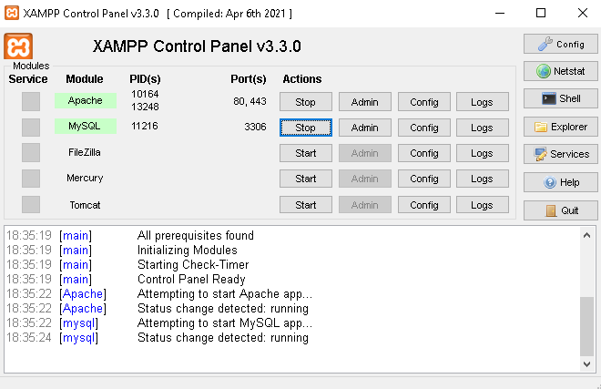
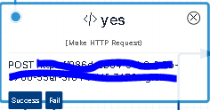
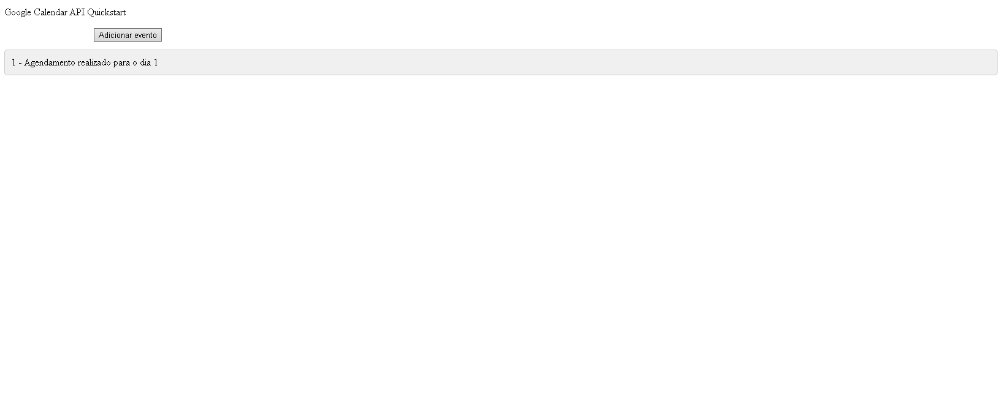
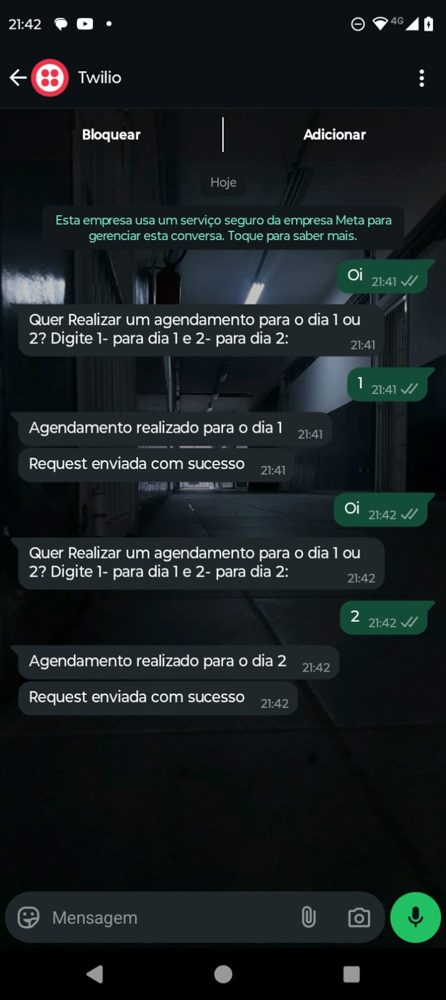

<h1 style='text-align: center;'>Plataforma de Google agenda com Chatbot WhatsApp</h1>

<p style='text-align: center;'>Agenda inteligente que recebe requisições de um chatbot no whatsapp e envia para o sistema para liberação e criação de evento no google agenda.</p>

<hr style="height:2px;border-width:0;color:gray;background-color:gray">
<h1>Tecnologias</h1>
<p>
Esse projeto foi desenvolvido com as seguintes tecnologias:    
<ul>
    <li>JavaScript</li>
    <li>PHP</li>
    <li>Servidor XAMPP</li>
    <li>Json</li>
    <li>Jquery | Ajax</li>
    <li>MySQL</li>
    <li>ChatBot: Twilio</li>
    <li>API Google Agenda</li>
    </ul>
</p>

<hr style="height:2px;border-width:0;color:gray;background-color:gray">
<h1>O que trata este projeto?</h1>
<p>Esse projeto se trata de um sistema de gerenciamento de requisições para agendar procedimentos em um salão de beleza, salvando esses eventos em uma agenda da google de acordo com a conta logada no email.</p>
<hr style="height:2px;border-width:0;color:gray;background-color:gray">
<h1>APIS Usadas</h1>
<p>  
<ul>
    <li>ChatBot, Twilio: uma ótima opção para criar chatbots para whatsApp com codificação em blocos</li>
    <li>API Google Agenda: Para receber as requisições de agendamento que forem aceitas pelo sistema</li>
</ul>
</p>
<hr style="height:2px;border-width:0;color:gray;background-color:gray">
<h1>Como Usar:</h1>
<h3>1. Servidor Xampp</h3>
<p>  
    Instalar o Xampp no site oficial, caso não tenha, depois ligar o servidor apache e o SQl.
</p>
<p style='text-align: center;'></p>
<p>  
    clonar o repositório para o caminho "xampp/htdocs".
</p>

 ```bash
git clone https://github.com/Poloyo1/Sistema-de-agenda-com-chatBot.git
```

importar o arquivo "agenda_bd" no admin SQL do servidor XAMPP.

<h3>2. Configurar .env </h2>

"Use o .env.example como referência para criar o seu arquivo de configuração .env com suas credenciais da Google Clound.

```yaml
API_KEY={YOUR_GOOGLE_API_KEY}
CLIENT_ID={YOUR_CLIENT_ID}
```
<h2 id="routes">3. API Endpoints</h2>

Aqui vou listar os endpoints utilizados paras as APIS utilizadas.
​
| route               | description                                          
|----------------------|-----------------------------------------------------
| <kbd>POST /authenticate</kbd>     | Recupera a mensagem vinda do bot-Twilio
<h3>4. Subir projeto no Ngrok </h2>

Utilizar ngrok para subir a porta localhost:80 do xampp em um servidor online para poder receber as informações do bot Twilio

```bash
ngrok http 80
```

<h3>5. Configurar Twilio </h2>

Para configurar a Twilio e criar seu bot é recomendável assitir uma video aula <a href='https://youtu.be/p9oPHrz3kB4?si=O3dRDjAt91RczGZM'>clique aqui</a>


Depois ao final da criação do Bot para WhatsApp, utilizar o bloco de requisição HTTP, passando o endpoit ngrok.
<p style='text-align: center;'></p>

```yaml
Request method = POST
Request URL = {SUA_URL_ENDPOINT_NGROK}/agendaBack-end/webhook.php
Content type = APPLICATION/JSON
Request body = {MENSAGEM_PARA_SER_GUARDADA_NO_BANCO_DE_DADOS}
```
<hr style="height:2px;border-width:0;color:gray;background-color:gray">
<h1>Exibição do projeto</h1>
Tela de exibição das requests:
<p style='text-align: center;'></p>
Testes Bot Twilio
<p style='text-align: center;'></p>
<hr style="height:2px;border-width:0;color:gray;background-color:gray">
<h1>Projeto ainda em Desenvolvimento...</h1>
Portanto, objetivos a serem concluidos:
<ul>
    <li>comunicação Google API com os sistema</li>
    <li>agendamento opcional</li>
    <li>sessão de horários de agendamento</li>
    <li>front-end</li>
</ul>
</p>
<h1>Obrigado por ler!</h1>